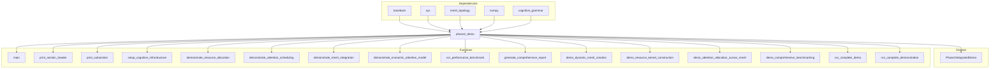

# phase2_demo - Architectural Flowchart

```mermaid
graph TD
    M[phase2_demo]

    subgraph "Classes"
        C0[Phase2IntegratedDemo]
    end

    M --> C0
    subgraph "Functions"
        F0[main]
        F2[print_section_header]
        F3[print_subsection]
        F4[setup_cognitive_infrastructure]
        F9[demonstrate_resource_allocation]
        F10[demonstrate_attention_scheduling]
        F11[demonstrate_mesh_integration]
        F12[demonstrate_economic_attention_model]
        F13[run_performance_benchmark]
        F14[generate_comprehensive_report]
        F15[demo_dynamic_mesh_creation]
        F16[demo_resource_kernel_construction]
        F17[demo_attention_allocation_across_mesh]
        F18[demo_comprehensive_benchmarking]
        F19[run_complete_demo]
        F20[run_complete_demonstration]
    end

    M --> F0
    M --> F2
    M --> F3
    M --> F4
    M --> F9
    M --> F10
    M --> F11
    M --> F12
    M --> F13
    M --> F14
    M --> F15
    M --> F16
    M --> F17
    M --> F18
    M --> F19
    M --> F20
    subgraph "Dependencies"
        D0[traceback]
        D1[sys]
        D2[mesh_topology]
        D3[numpy]
        D4[cognitive_grammar]
    end

    D0 --> M
    D1 --> M
    D2 --> M
    D3 --> M
    D4 --> M
```
