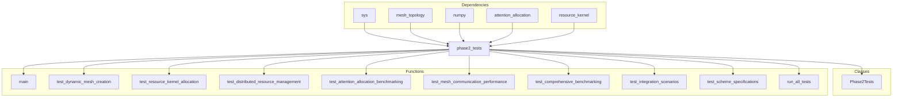

# phase2_tests - Architectural Flowchart

```mermaid
graph TD
    M[phase2_tests]

    subgraph "Classes"
        C0[Phase2Tests]
    end

    M --> C0
    subgraph "Functions"
        F0[main]
        F2[test_dynamic_mesh_creation]
        F3[test_resource_kernel_allocation]
        F4[test_distributed_resource_management]
        F5[test_attention_allocation_benchmarking]
        F6[test_mesh_communication_performance]
        F7[test_comprehensive_benchmarking]
        F8[test_integration_scenarios]
        F9[test_scheme_specifications]
        F10[run_all_tests]
    end

    M --> F0
    M --> F2
    M --> F3
    M --> F4
    M --> F5
    M --> F6
    M --> F7
    M --> F8
    M --> F9
    M --> F10
    subgraph "Dependencies"
        D0[sys]
        D1[mesh_topology]
        D2[numpy]
        D3[attention_allocation]
        D4[resource_kernel]
    end

    D0 --> M
    D1 --> M
    D2 --> M
    D3 --> M
    D4 --> M
```
