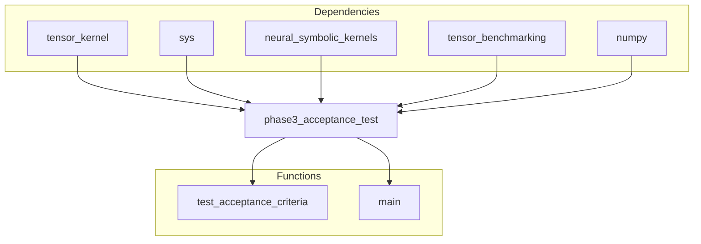

# phase3_acceptance_test - Architectural Flowchart

```mermaid
graph TD
    M[phase3_acceptance_test]

    subgraph "Functions"
        F0[test_acceptance_criteria]
        F1[main]
    end

    M --> F0
    M --> F1
    subgraph "Dependencies"
        D0[tensor_kernel]
        D1[sys]
        D2[neural_symbolic_kernels]
        D3[tensor_benchmarking]
        D4[numpy]
    end

    D0 --> M
    D1 --> M
    D2 --> M
    D3 --> M
    D4 --> M
```
