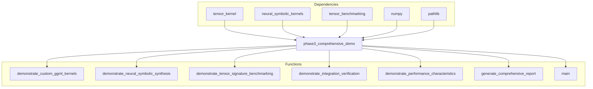

# phase3_comprehensive_demo - Architectural Flowchart

```mermaid
graph TD
    M[phase3_comprehensive_demo]

    subgraph "Functions"
        F0[demonstrate_custom_ggml_kernels]
        F1[demonstrate_neural_symbolic_synthesis]
        F2[demonstrate_tensor_signature_benchmarking]
        F3[demonstrate_integration_verification]
        F4[demonstrate_performance_characteristics]
        F5[generate_comprehensive_report]
        F6[main]
    end

    M --> F0
    M --> F1
    M --> F2
    M --> F3
    M --> F4
    M --> F5
    M --> F6
    subgraph "Dependencies"
        D0[tensor_kernel]
        D1[neural_symbolic_kernels]
        D2[tensor_benchmarking]
        D3[numpy]
        D4[pathlib]
    end

    D0 --> M
    D1 --> M
    D2 --> M
    D3 --> M
    D4 --> M
```
