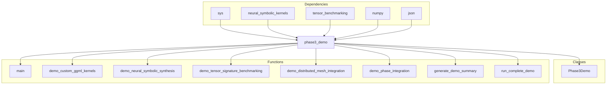

# phase3_demo - Architectural Flowchart

```mermaid
graph TD
    M[phase3_demo]

    subgraph "Classes"
        C0[Phase3Demo]
    end

    M --> C0
    subgraph "Functions"
        F0[main]
        F2[demo_custom_ggml_kernels]
        F3[demo_neural_symbolic_synthesis]
        F4[demo_tensor_signature_benchmarking]
        F5[demo_distributed_mesh_integration]
        F6[demo_phase_integration]
        F7[generate_demo_summary]
        F8[run_complete_demo]
    end

    M --> F0
    M --> F2
    M --> F3
    M --> F4
    M --> F5
    M --> F6
    M --> F7
    M --> F8
    subgraph "Dependencies"
        D0[sys]
        D1[neural_symbolic_kernels]
        D2[tensor_benchmarking]
        D3[numpy]
        D4[json]
    end

    D0 --> M
    D1 --> M
    D2 --> M
    D3 --> M
    D4 --> M
```
