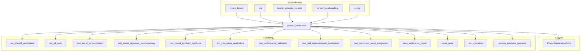

# phase3_verification - Architectural Flowchart

```mermaid
graph TD
    M[phase3_verification]

    subgraph "Classes"
        C0[Phase3VerificationSuite]
    end

    M --> C0
    subgraph "Functions"
        F0[run_phase3_verification]
        F2[run_all_tests]
        F3[test_kernel_customization]
        F4[test_tensor_signature_benchmarking]
        F5[test_neural_symbolic_synthesis]
        F6[test_integration_verification]
        F7[test_performance_validation]
        F8[test_real_implementation_verification]
        F9[test_distributed_mesh_integration]
        F11[save_verification_report]
        F12[count_tests]
        F13[test_operation]
        F14[memory_intensive_operation]
    end

    M --> F0
    M --> F2
    M --> F3
    M --> F4
    M --> F5
    M --> F6
    M --> F7
    M --> F8
    M --> F9
    M --> F11
    M --> F12
    M --> F13
    M --> F14
    subgraph "Dependencies"
        D0[tensor_kernel]
        D1[sys]
        D2[neural_symbolic_kernels]
        D3[tensor_benchmarking]
        D4[numpy]
    end

    D0 --> M
    D1 --> M
    D2 --> M
    D3 --> M
    D4 --> M
```
