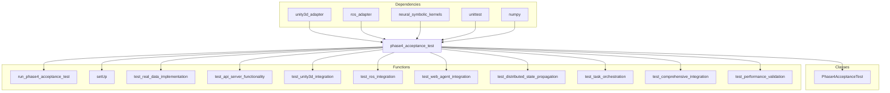

# phase4_acceptance_test - Architectural Flowchart

```mermaid
graph TD
    M[phase4_acceptance_test]

    subgraph "Classes"
        C0[Phase4AcceptanceTest]
    end

    M --> C0
    subgraph "Functions"
        F0[run_phase4_acceptance_test]
        F1[setUp]
        F2[test_real_data_implementation]
        F3[test_api_server_functionality]
        F4[test_unity3d_integration]
        F5[test_ros_integration]
        F6[test_web_agent_integration]
        F7[test_distributed_state_propagation]
        F8[test_task_orchestration]
        F9[test_comprehensive_integration]
        F10[test_performance_validation]
    end

    M --> F0
    M --> F1
    M --> F2
    M --> F3
    M --> F4
    M --> F5
    M --> F6
    M --> F7
    M --> F8
    M --> F9
    M --> F10
    subgraph "Dependencies"
        D0[unity3d_adapter]
        D1[ros_adapter]
        D2[neural_symbolic_kernels]
        D3[unittest]
        D4[numpy]
    end

    D0 --> M
    D1 --> M
    D2 --> M
    D3 --> M
    D4 --> M
```
