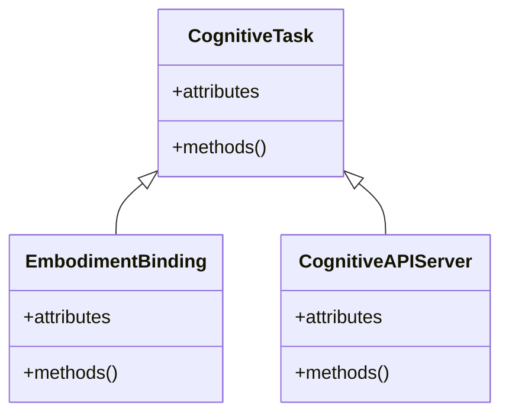

# phase4_api_server - Class Diagram

```mermaid
classDiagram

    class CognitiveTask {
        +methods()
        +attributes
    }

    class EmbodimentBinding {
        +methods()
        +attributes
    }

    class CognitiveAPIServer {
        +methods()
        +attributes
    }

    CognitiveTask <|-- EmbodimentBinding
    CognitiveTask <|-- CognitiveAPIServer
```
