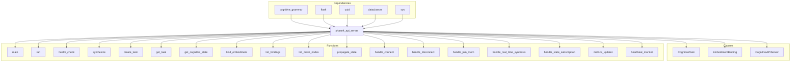

# phase4_api_server - Architectural Flowchart

```mermaid
graph TD
    M[phase4_api_server]

    subgraph "Classes"
        C0[CognitiveTask]
        C1[EmbodimentBinding]
        C2[CognitiveAPIServer]
    end

    M --> C0
    M --> C1
    M --> C2
    subgraph "Functions"
        F0[main]
        F20[run]
        F21[health_check]
        F22[synthesize]
        F23[create_task]
        F24[get_task]
        F25[get_cognitive_state]
        F26[bind_embodiment]
        F27[list_bindings]
        F28[list_mesh_nodes]
        F29[propagate_state]
        F30[handle_connect]
        F31[handle_disconnect]
        F32[handle_join_room]
        F33[handle_real_time_synthesis]
        F34[handle_state_subscription]
        F35[metrics_updater]
        F36[heartbeat_monitor]
    end

    M --> F0
    M --> F20
    M --> F21
    M --> F22
    M --> F23
    M --> F24
    M --> F25
    M --> F26
    M --> F27
    M --> F28
    M --> F29
    M --> F30
    M --> F31
    M --> F32
    M --> F33
    M --> F34
    M --> F35
    M --> F36
    subgraph "Dependencies"
        D0[cognitive_grammar]
        D1[flask]
        D2[uuid]
        D3[dataclasses]
        D4[sys]
    end

    D0 --> M
    D1 --> M
    D2 --> M
    D3 --> M
    D4 --> M
```
