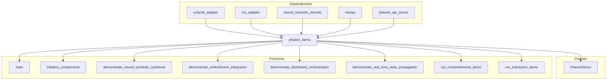

# phase4_demo - Architectural Flowchart

```mermaid
graph TD
    M[phase4_demo]

    subgraph "Classes"
        C0[Phase4Demo]
    end

    M --> C0
    subgraph "Functions"
        F0[main]
        F2[initialize_components]
        F3[demonstrate_neural_symbolic_synthesis]
        F4[demonstrate_embodiment_integration]
        F5[demonstrate_distributed_orchestration]
        F9[demonstrate_real_time_state_propagation]
        F10[run_comprehensive_demo]
        F11[run_interactive_demo]
    end

    M --> F0
    M --> F2
    M --> F3
    M --> F4
    M --> F5
    M --> F9
    M --> F10
    M --> F11
    subgraph "Dependencies"
        D0[unity3d_adapter]
        D1[ros_adapter]
        D2[neural_symbolic_kernels]
        D3[numpy]
        D4[phase4_api_server]
    end

    D0 --> M
    D1 --> M
    D2 --> M
    D3 --> M
    D4 --> M
```
