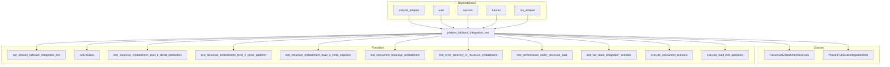

# phase4_fullstack_integration_test - Architectural Flowchart

```mermaid
graph TD
    M[phase4_fullstack_integration_test]

    subgraph "Classes"
        C0[RecursiveEmbodimentScenario]
        C1[Phase4FullStackIntegrationTest]
    end

    M --> C0
    M --> C1
    subgraph "Functions"
        F0[run_phase4_fullstack_integration_test]
        F2[setUpClass]
        F4[test_recursive_embodiment_level_1_direct_interaction]
        F5[test_recursive_embodiment_level_2_cross_platform]
        F6[test_recursive_embodiment_level_3_meta_cognitive]
        F7[test_concurrent_recursive_embodiment]
        F8[test_error_recovery_in_recursive_embodiment]
        F9[test_performance_under_recursive_load]
        F10[test_full_stack_integration_scenario]
        F11[execute_concurrent_scenario]
        F12[execute_load_test_operation]
    end

    M --> F0
    M --> F2
    M --> F4
    M --> F5
    M --> F6
    M --> F7
    M --> F8
    M --> F9
    M --> F10
    M --> F11
    M --> F12
    subgraph "Dependencies"
        D0[unity3d_adapter]
        D1[uuid]
        D2[asyncio]
        D3[futures]
        D4[ros_adapter]
    end

    D0 --> M
    D1 --> M
    D2 --> M
    D3 --> M
    D4 --> M
```
