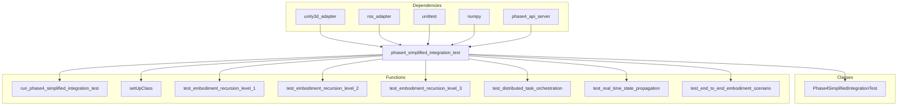

# phase4_simplified_integration_test - Architectural Flowchart

```mermaid
graph TD
    M[phase4_simplified_integration_test]

    subgraph "Classes"
        C0[Phase4SimplifiedIntegrationTest]
    end

    M --> C0
    subgraph "Functions"
        F0[run_phase4_simplified_integration_test]
        F1[setUpClass]
        F2[test_embodiment_recursion_level_1]
        F3[test_embodiment_recursion_level_2]
        F4[test_embodiment_recursion_level_3]
        F5[test_distributed_task_orchestration]
        F6[test_real_time_state_propagation]
        F7[test_end_to_end_embodiment_scenario]
    end

    M --> F0
    M --> F1
    M --> F2
    M --> F3
    M --> F4
    M --> F5
    M --> F6
    M --> F7
    subgraph "Dependencies"
        D0[unity3d_adapter]
        D1[ros_adapter]
        D2[unittest]
        D3[numpy]
        D4[phase4_api_server]
    end

    D0 --> M
    D1 --> M
    D2 --> M
    D3 --> M
    D4 --> M
```
