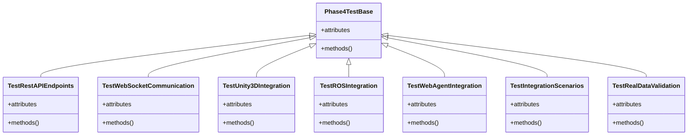

# phase4_tests - Class Diagram

```mermaid
classDiagram

    class Phase4TestBase {
        +methods()
        +attributes
    }

    class TestRestAPIEndpoints {
        +methods()
        +attributes
    }

    class TestWebSocketCommunication {
        +methods()
        +attributes
    }

    class TestUnity3DIntegration {
        +methods()
        +attributes
    }

    class TestROSIntegration {
        +methods()
        +attributes
    }

    class TestWebAgentIntegration {
        +methods()
        +attributes
    }

    class TestIntegrationScenarios {
        +methods()
        +attributes
    }

    class TestRealDataValidation {
        +methods()
        +attributes
    }

    Phase4TestBase <|-- TestRestAPIEndpoints
    Phase4TestBase <|-- TestWebSocketCommunication
    Phase4TestBase <|-- TestUnity3DIntegration
    Phase4TestBase <|-- TestROSIntegration
    Phase4TestBase <|-- TestWebAgentIntegration
    Phase4TestBase <|-- TestIntegrationScenarios
    Phase4TestBase <|-- TestRealDataValidation
```
