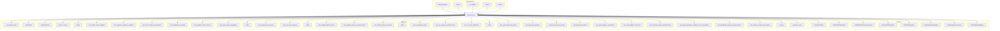

# phase4_tests - Architectural Flowchart

```mermaid
graph TD
    M[phase4_tests]

    subgraph "Classes"
        C0[Phase4TestBase]
        C1[TestRestAPIEndpoints]
        C2[TestWebSocketCommunication]
        C3[TestUnity3DIntegration]
        C4[TestROSIntegration]
        C5[TestWebAgentIntegration]
        C6[TestIntegrationScenarios]
        C7[TestRealDataValidation]
    end

    M --> C0
    M --> C1
    M --> C2
    M --> C3
    M --> C4
    M --> C5
    M --> C6
    M --> C7
    subgraph "Functions"
        F0[run_phase4_tests]
        F1[setUpClass]
        F3[tearDownClass]
        F6[wait_for_server]
        F7[setUp]
        F8[test_health_check_endpoint]
        F9[test_cognitive_synthesis_endpoint]
        F10[test_task_creation_and_retrieval]
        F11[test_embodiment_binding]
        F12[test_cognitive_state_retrieval]
        F13[test_mesh_state_propagation]
        F14[setUp]
        F15[test_websocket_connection]
        F16[test_real_time_synthesis]
        F17[setUp]
        F18[test_unity3d_adapter_status]
        F19[test_unity3d_protocol_communication]
        F20[test_unity3d_action_execution]
        F21[setUp]
        F22[test_ros_adapter_status]
        F23[test_ros_protocol_communication]
        F24[test_ros_topic_publishing]
        F25[setUp]
        F26[test_web_dashboard_access]
        F27[test_web_api_endpoints]
        F28[test_javascript_sdk_serving]
        F29[test_web_task_creation]
        F30[test_multi_adapter_coordination]
        F31[test_cross_adapter_task_flow]
        F32[test_real_time_state_synchronization]
        F33[test_neural_symbolic_synthesis_real_computation]
        F34[test_distributed_mesh_real_performance]
        F35[test_memory_usage_real_tracking]
        F36[connect]
        F37[synthesis_result]
    end

    M --> F0
    M --> F1
    M --> F3
    M --> F6
    M --> F7
    M --> F8
    M --> F9
    M --> F10
    M --> F11
    M --> F12
    M --> F13
    M --> F14
    M --> F15
    M --> F16
    M --> F17
    M --> F18
    M --> F19
    M --> F20
    M --> F21
    M --> F22
    M --> F23
    M --> F24
    M --> F25
    M --> F26
    M --> F27
    M --> F28
    M --> F29
    M --> F30
    M --> F31
    M --> F32
    M --> F33
    M --> F34
    M --> F35
    M --> F36
    M --> F37
    subgraph "Dependencies"
        D0[unity3d_adapter]
        D1[futures]
        D2[ros_adapter]
        D3[unittest]
        D4[numpy]
    end

    D0 --> M
    D1 --> M
    D2 --> M
    D3 --> M
    D4 --> M
```
