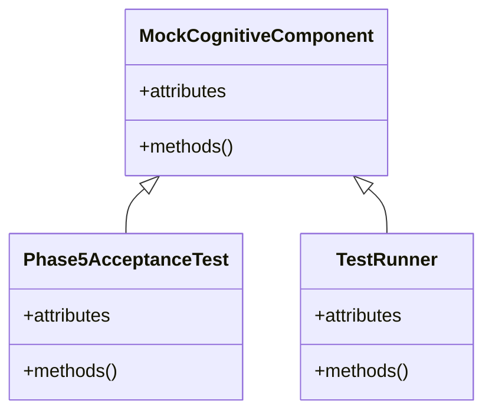

# phase5_acceptance_test - Class Diagram

```mermaid
classDiagram

    class MockCognitiveComponent {
        +methods()
        +attributes
    }

    class Phase5AcceptanceTest {
        +methods()
        +attributes
    }

    class TestRunner {
        +methods()
        +attributes
    }

    MockCognitiveComponent <|-- Phase5AcceptanceTest
    MockCognitiveComponent <|-- TestRunner
```
