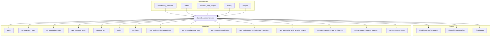

# phase5_acceptance_test - Architectural Flowchart

```mermaid
graph TD
    M[phase5_acceptance_test]

    subgraph "Classes"
        C0[MockCognitiveComponent]
        C1[Phase5AcceptanceTest]
        C2[TestRunner]
    end

    M --> C0
    M --> C1
    M --> C2
    subgraph "Functions"
        F0[main]
        F2[get_operation_stats]
        F3[get_knowledge_stats]
        F4[get_economic_stats]
        F5[simulate_work]
        F6[setUp]
        F7[tearDown]
        F8[test_real_data_implementation]
        F9[test_comprehensive_tests]
        F10[test_recursive_modularity]
        F11[test_evolutionary_optimization_integration]
        F12[test_integration_with_existing_phases]
        F13[test_documentation_and_architecture]
        F14[test_acceptance_criteria_summary]
        F15[run_acceptance_tests]
    end

    M --> F0
    M --> F2
    M --> F3
    M --> F4
    M --> F5
    M --> F6
    M --> F7
    M --> F8
    M --> F9
    M --> F10
    M --> F11
    M --> F12
    M --> F13
    M --> F14
    M --> F15
    subgraph "Dependencies"
        D0[evolutionary_optimizer]
        D1[unittest]
        D2[feedback_self_analysis]
        D3[numpy]
        D4[tempfile]
    end

    D0 --> M
    D1 --> M
    D2 --> M
    D3 --> M
    D4 --> M
```
