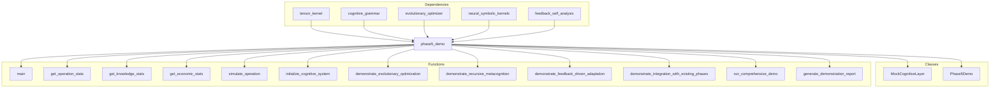

# phase5_demo - Architectural Flowchart

```mermaid
graph TD
    M[phase5_demo]

    subgraph "Classes"
        C0[MockCognitiveLayer]
        C1[Phase5Demo]
    end

    M --> C0
    M --> C1
    subgraph "Functions"
        F0[main]
        F2[get_operation_stats]
        F3[get_knowledge_stats]
        F4[get_economic_stats]
        F5[simulate_operation]
        F7[initialize_cognitive_system]
        F8[demonstrate_evolutionary_optimization]
        F10[demonstrate_recursive_metacognition]
        F11[demonstrate_feedback_driven_adaptation]
        F13[demonstrate_integration_with_existing_phases]
        F14[run_comprehensive_demo]
        F15[generate_demonstration_report]
    end

    M --> F0
    M --> F2
    M --> F3
    M --> F4
    M --> F5
    M --> F7
    M --> F8
    M --> F10
    M --> F11
    M --> F13
    M --> F14
    M --> F15
    subgraph "Dependencies"
        D0[tensor_kernel]
        D1[cognitive_grammar]
        D2[evolutionary_optimizer]
        D3[neural_symbolic_kernels]
        D4[feedback_self_analysis]
    end

    D0 --> M
    D1 --> M
    D2 --> M
    D3 --> M
    D4 --> M
```
