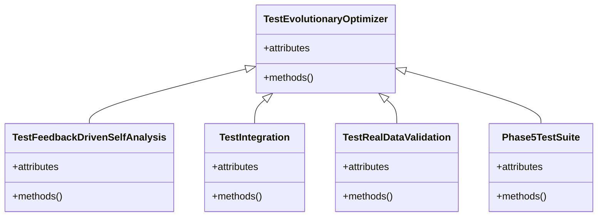

# phase5_tests - Class Diagram

```mermaid
classDiagram

    class TestEvolutionaryOptimizer {
        +methods()
        +attributes
    }

    class TestFeedbackDrivenSelfAnalysis {
        +methods()
        +attributes
    }

    class TestIntegration {
        +methods()
        +attributes
    }

    class TestRealDataValidation {
        +methods()
        +attributes
    }

    class Phase5TestSuite {
        +methods()
        +attributes
    }

    TestEvolutionaryOptimizer <|-- TestFeedbackDrivenSelfAnalysis
    TestEvolutionaryOptimizer <|-- TestIntegration
    TestEvolutionaryOptimizer <|-- TestRealDataValidation
    TestEvolutionaryOptimizer <|-- Phase5TestSuite
```
