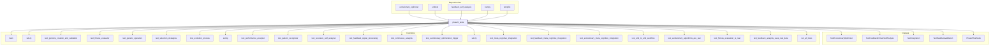

# phase5_tests - Architectural Flowchart

```mermaid
graph TD
    M[phase5_tests]

    subgraph "Classes"
        C0[TestEvolutionaryOptimizer]
        C1[TestFeedbackDrivenSelfAnalysis]
        C2[TestIntegration]
        C3[TestRealDataValidation]
        C4[Phase5TestSuite]
    end

    M --> C0
    M --> C1
    M --> C2
    M --> C3
    M --> C4
    subgraph "Functions"
        F0[main]
        F1[setUp]
        F2[test_genome_creation_and_validation]
        F3[test_fitness_evaluator]
        F4[test_genetic_operators]
        F5[test_selection_strategies]
        F6[test_evolution_process]
        F7[setUp]
        F8[test_performance_analyzer]
        F9[test_pattern_recognizer]
        F10[test_recursive_self_analyzer]
        F11[test_feedback_signal_processing]
        F12[test_continuous_analysis]
        F13[test_evolutionary_optimization_trigger]
        F14[setUp]
        F15[test_meta_cognitive_integration]
        F16[test_feedback_meta_cognitive_integration]
        F17[test_evolutionary_meta_cognitive_integration]
        F18[test_end_to_end_workflow]
        F19[test_evolutionary_algorithms_are_real]
        F20[test_fitness_evaluation_is_real]
        F21[test_feedback_analysis_uses_real_data]
        F22[run_all_tests]
    end

    M --> F0
    M --> F1
    M --> F2
    M --> F3
    M --> F4
    M --> F5
    M --> F6
    M --> F7
    M --> F8
    M --> F9
    M --> F10
    M --> F11
    M --> F12
    M --> F13
    M --> F14
    M --> F15
    M --> F16
    M --> F17
    M --> F18
    M --> F19
    M --> F20
    M --> F21
    M --> F22
    subgraph "Dependencies"
        D0[evolutionary_optimizer]
        D1[unittest]
        D2[feedback_self_analysis]
        D3[numpy]
        D4[tempfile]
    end

    D0 --> M
    D1 --> M
    D2 --> M
    D3 --> M
    D4 --> M
```
