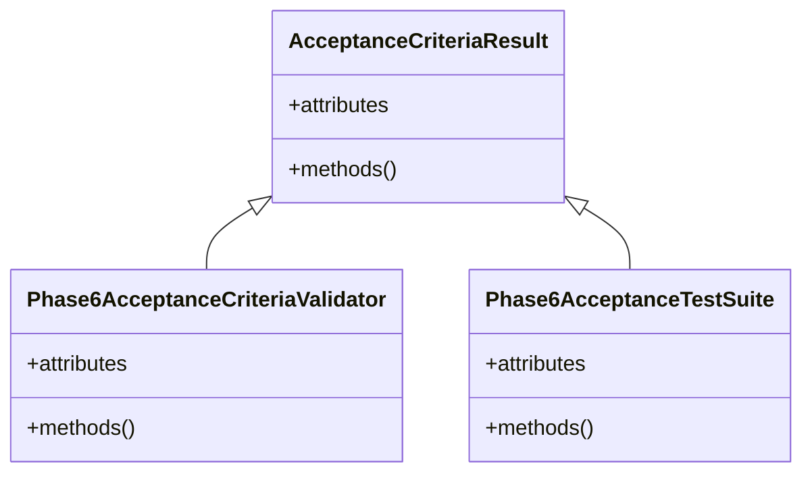

# phase6_acceptance_test - Class Diagram

```mermaid
classDiagram

    class AcceptanceCriteriaResult {
        +methods()
        +attributes
    }

    class Phase6AcceptanceCriteriaValidator {
        +methods()
        +attributes
    }

    class Phase6AcceptanceTestSuite {
        +methods()
        +attributes
    }

    AcceptanceCriteriaResult <|-- Phase6AcceptanceCriteriaValidator
    AcceptanceCriteriaResult <|-- Phase6AcceptanceTestSuite
```
