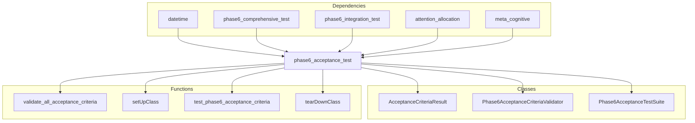

# phase6_acceptance_test - Architectural Flowchart

```mermaid
graph TD
    M[phase6_acceptance_test]

    subgraph "Classes"
        C0[AcceptanceCriteriaResult]
        C1[Phase6AcceptanceCriteriaValidator]
        C2[Phase6AcceptanceTestSuite]
    end

    M --> C0
    M --> C1
    M --> C2
    subgraph "Functions"
        F2[validate_all_acceptance_criteria]
        F10[setUpClass]
        F11[test_phase6_acceptance_criteria]
        F12[tearDownClass]
    end

    M --> F2
    M --> F10
    M --> F11
    M --> F12
    subgraph "Dependencies"
        D0[datetime]
        D1[phase6_comprehensive_test]
        D2[phase6_integration_test]
        D3[attention_allocation]
        D4[meta_cognitive]
    end

    D0 --> M
    D1 --> M
    D2 --> M
    D3 --> M
    D4 --> M
```
