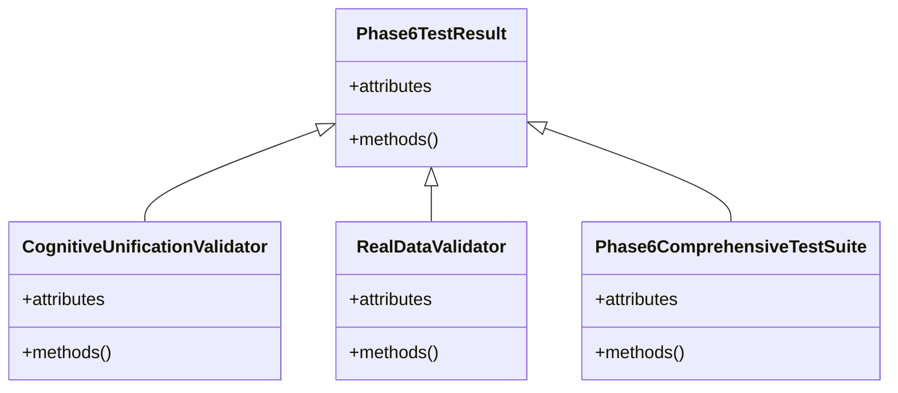

# phase6_comprehensive_test - Class Diagram

```mermaid
classDiagram

    class Phase6TestResult {
        +methods()
        +attributes
    }

    class CognitiveUnificationValidator {
        +methods()
        +attributes
    }

    class RealDataValidator {
        +methods()
        +attributes
    }

    class Phase6ComprehensiveTestSuite {
        +methods()
        +attributes
    }

    Phase6TestResult <|-- CognitiveUnificationValidator
    Phase6TestResult <|-- RealDataValidator
    Phase6TestResult <|-- Phase6ComprehensiveTestSuite
```
