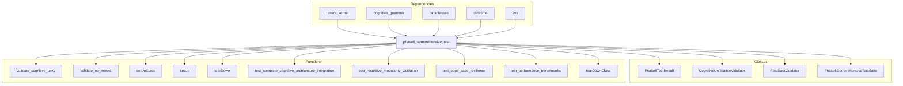

# phase6_comprehensive_test - Architectural Flowchart

```mermaid
graph TD
    M[phase6_comprehensive_test]

    subgraph "Classes"
        C0[Phase6TestResult]
        C1[CognitiveUnificationValidator]
        C2[RealDataValidator]
        C3[Phase6ComprehensiveTestSuite]
    end

    M --> C0
    M --> C1
    M --> C2
    M --> C3
    subgraph "Functions"
        F1[validate_cognitive_unity]
        F12[validate_no_mocks]
        F14[setUpClass]
        F15[setUp]
        F16[tearDown]
        F17[test_complete_cognitive_architecture_integration]
        F20[test_recursive_modularity_validation]
        F24[test_edge_case_resilience]
        F29[test_performance_benchmarks]
        F30[tearDownClass]
    end

    M --> F1
    M --> F12
    M --> F14
    M --> F15
    M --> F16
    M --> F17
    M --> F20
    M --> F24
    M --> F29
    M --> F30
    subgraph "Dependencies"
        D0[tensor_kernel]
        D1[cognitive_grammar]
        D2[dataclasses]
        D3[datetime]
        D4[sys]
    end

    D0 --> M
    D1 --> M
    D2 --> M
    D3 --> M
    D4 --> M
```
