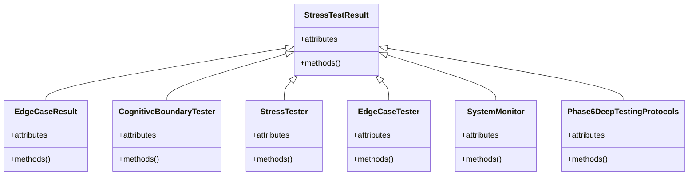

# phase6_deep_testing_protocols - Class Diagram

```mermaid
classDiagram

    class StressTestResult {
        +methods()
        +attributes
    }

    class EdgeCaseResult {
        +methods()
        +attributes
    }

    class CognitiveBoundaryTester {
        +methods()
        +attributes
    }

    class StressTester {
        +methods()
        +attributes
    }

    class EdgeCaseTester {
        +methods()
        +attributes
    }

    class SystemMonitor {
        +methods()
        +attributes
    }

    class Phase6DeepTestingProtocols {
        +methods()
        +attributes
    }

    StressTestResult <|-- EdgeCaseResult
    StressTestResult <|-- CognitiveBoundaryTester
    StressTestResult <|-- StressTester
    StressTestResult <|-- EdgeCaseTester
    StressTestResult <|-- SystemMonitor
    StressTestResult <|-- Phase6DeepTestingProtocols
```
