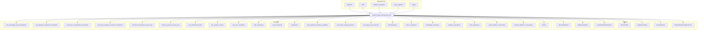

# phase6_deep_testing_protocols - Architectural Flowchart

```mermaid
graph TD
    M[phase6_deep_testing_protocols]

    subgraph "Classes"
        C0[StressTestResult]
        C1[EdgeCaseResult]
        C2[CognitiveBoundaryTester]
        C3[StressTester]
        C4[EdgeCaseTester]
        C5[SystemMonitor]
        C6[Phase6DeepTestingProtocols]
    end

    M --> C0
    M --> C1
    M --> C2
    M --> C3
    M --> C4
    M --> C5
    M --> C6
    subgraph "Functions"
        F1[test_knowledge_scale_boundaries]
        F2[test_attention_saturation_boundaries]
        F3[test_tensor_computation_boundaries]
        F4[test_meta_cognitive_recursion_boundaries]
        F6[concurrent_operations_stress_test]
        F7[memory_pressure_stress_test]
        F9[test_malformed_inputs]
        F10[test_extreme_values]
        F11[test_race_conditions]
        F13[start_monitoring]
        F14[stop_monitoring]
        F15[setUpClass]
        F16[test_cognitive_boundary_validation]
        F17[test_stress_testing_protocols]
        F18[test_edge_case_protocols]
        F19[tearDownClass]
        F20[tensor_operations]
        F21[knowledge_operations]
        F22[attention_operations]
        F23[meta_operations]
        F24[create_entities_concurrently]
        F25[allocate_attention_concurrently]
        F26[monitor]
    end

    M --> F1
    M --> F2
    M --> F3
    M --> F4
    M --> F6
    M --> F7
    M --> F9
    M --> F10
    M --> F11
    M --> F13
    M --> F14
    M --> F15
    M --> F16
    M --> F17
    M --> F18
    M --> F19
    M --> F20
    M --> F21
    M --> F22
    M --> F23
    M --> F24
    M --> F25
    M --> F26
    subgraph "Dependencies"
        D0[datetime]
        D1[math]
        D2[attention_allocation]
        D3[meta_cognitive]
        D4[typing]
    end

    D0 --> M
    D1 --> M
    D2 --> M
    D3 --> M
    D4 --> M
```
