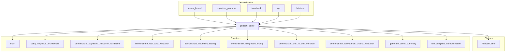

# phase6_demo - Architectural Flowchart

```mermaid
graph TD
    M[phase6_demo]

    subgraph "Classes"
        C0[Phase6Demo]
    end

    M --> C0
    subgraph "Functions"
        F0[main]
        F2[setup_cognitive_architecture]
        F3[demonstrate_cognitive_unification_validation]
        F4[demonstrate_real_data_validation]
        F5[demonstrate_boundary_testing]
        F6[demonstrate_integration_testing]
        F7[demonstrate_end_to_end_workflow]
        F8[demonstrate_acceptance_criteria_validation]
        F9[generate_demo_summary]
        F10[run_complete_demonstration]
    end

    M --> F0
    M --> F2
    M --> F3
    M --> F4
    M --> F5
    M --> F6
    M --> F7
    M --> F8
    M --> F9
    M --> F10
    subgraph "Dependencies"
        D0[tensor_kernel]
        D1[cognitive_grammar]
        D2[traceback]
        D3[sys]
        D4[datetime]
    end

    D0 --> M
    D1 --> M
    D2 --> M
    D3 --> M
    D4 --> M
```
