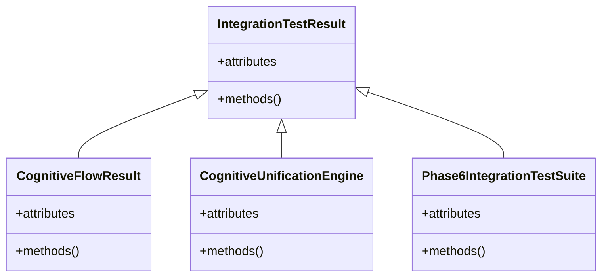

# phase6_integration_test - Class Diagram

```mermaid
classDiagram

    class IntegrationTestResult {
        +methods()
        +attributes
    }

    class CognitiveFlowResult {
        +methods()
        +attributes
    }

    class CognitiveUnificationEngine {
        +methods()
        +attributes
    }

    class Phase6IntegrationTestSuite {
        +methods()
        +attributes
    }

    IntegrationTestResult <|-- CognitiveFlowResult
    IntegrationTestResult <|-- CognitiveUnificationEngine
    IntegrationTestResult <|-- Phase6IntegrationTestSuite
```
