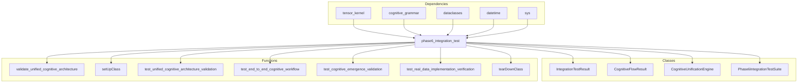

# phase6_integration_test - Architectural Flowchart

```mermaid
graph TD
    M[phase6_integration_test]

    subgraph "Classes"
        C0[IntegrationTestResult]
        C1[CognitiveFlowResult]
        C2[CognitiveUnificationEngine]
        C3[Phase6IntegrationTestSuite]
    end

    M --> C0
    M --> C1
    M --> C2
    M --> C3
    subgraph "Functions"
        F1[validate_unified_cognitive_architecture]
        F25[setUpClass]
        F26[test_unified_cognitive_architecture_validation]
        F27[test_end_to_end_cognitive_workflow]
        F28[test_cognitive_emergence_validation]
        F29[test_real_data_implementation_verification]
        F30[tearDownClass]
    end

    M --> F1
    M --> F25
    M --> F26
    M --> F27
    M --> F28
    M --> F29
    M --> F30
    subgraph "Dependencies"
        D0[tensor_kernel]
        D1[cognitive_grammar]
        D2[dataclasses]
        D3[datetime]
        D4[sys]
    end

    D0 --> M
    D1 --> M
    D2 --> M
    D3 --> M
    D4 --> M
```
