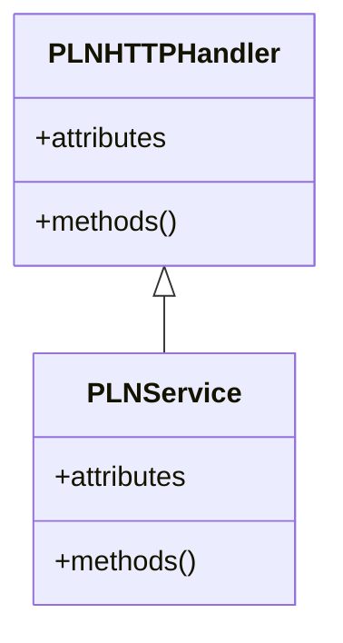

# pln_service - Class Diagram

```mermaid
classDiagram

    class PLNHTTPHandler {
        +methods()
        +attributes
    }

    class PLNService {
        +methods()
        +attributes
    }

    PLNHTTPHandler <|-- PLNService
```
