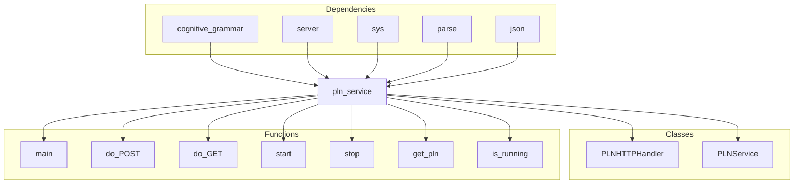

# pln_service - Architectural Flowchart

```mermaid
graph TD
    M[pln_service]

    subgraph "Classes"
        C0[PLNHTTPHandler]
        C1[PLNService]
    end

    M --> C0
    M --> C1
    subgraph "Functions"
        F0[main]
        F1[do_POST]
        F2[do_GET]
        F12[start]
        F13[stop]
        F14[get_pln]
        F15[is_running]
    end

    M --> F0
    M --> F1
    M --> F2
    M --> F12
    M --> F13
    M --> F14
    M --> F15
    subgraph "Dependencies"
        D0[cognitive_grammar]
        D1[server]
        D2[sys]
        D3[parse]
        D4[json]
    end

    D0 --> M
    D1 --> M
    D2 --> M
    D3 --> M
    D4 --> M
```
