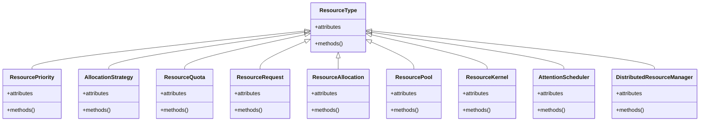

# resource_kernel - Class Diagram

```mermaid
classDiagram

    class ResourceType {
        +methods()
        +attributes
    }

    class ResourcePriority {
        +methods()
        +attributes
    }

    class AllocationStrategy {
        +methods()
        +attributes
    }

    class ResourceQuota {
        +methods()
        +attributes
    }

    class ResourceRequest {
        +methods()
        +attributes
    }

    class ResourceAllocation {
        +methods()
        +attributes
    }

    class ResourcePool {
        +methods()
        +attributes
    }

    class ResourceKernel {
        +methods()
        +attributes
    }

    class AttentionScheduler {
        +methods()
        +attributes
    }

    class DistributedResourceManager {
        +methods()
        +attributes
    }

    ResourceType <|-- ResourcePriority
    ResourceType <|-- AllocationStrategy
    ResourceType <|-- ResourceQuota
    ResourceType <|-- ResourceRequest
    ResourceType <|-- ResourceAllocation
    ResourceType <|-- ResourcePool
    ResourceType <|-- ResourceKernel
    ResourceType <|-- AttentionScheduler
    ResourceType <|-- DistributedResourceManager
```
