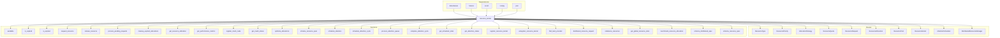

# resource_kernel - Architectural Flowchart

```mermaid
graph TD
    M[resource_kernel]

    subgraph "Classes"
        C0[ResourceType]
        C1[ResourcePriority]
        C2[AllocationStrategy]
        C3[ResourceQuota]
        C4[ResourceRequest]
        C5[ResourceAllocation]
        C6[ResourcePool]
        C7[ResourceKernel]
        C8[AttentionScheduler]
        C9[DistributedResourceManager]
    end

    M --> C0
    M --> C1
    M --> C2
    M --> C3
    M --> C4
    M --> C5
    M --> C6
    M --> C7
    M --> C8
    M --> C9
    subgraph "Functions"
        F0[available]
        F2[is_expired]
        F3[is_expired]
        F8[request_resource]
        F11[release_resource]
        F12[process_pending_requests]
        F13[cleanup_expired_allocations]
        F14[get_resource_utilization]
        F15[get_performance_metrics]
        F16[register_mesh_node]
        F17[get_mesh_status]
        F18[optimize_allocations]
        F19[scheme_resource_spec]
        F21[schedule_attention]
        F22[schedule_attention_cycle]
        F23[process_attention_queue]
        F24[complete_attention_cycle]
        F25[get_scheduler_stats]
        F26[get_attention_status]
        F28[register_resource_kernel]
        F29[unregister_resource_kernel]
        F31[find_best_provider]
        F32[distributed_resource_request]
        F33[rebalance_resources]
        F34[get_global_resource_stats]
        F35[benchmark_resource_allocation]
        F36[scheme_distributed_spec]
        F37[scheme_resource_spec]
    end

    M --> F0
    M --> F2
    M --> F3
    M --> F8
    M --> F11
    M --> F12
    M --> F13
    M --> F14
    M --> F15
    M --> F16
    M --> F17
    M --> F18
    M --> F19
    M --> F21
    M --> F22
    M --> F23
    M --> F24
    M --> F25
    M --> F26
    M --> F28
    M --> F29
    M --> F31
    M --> F32
    M --> F33
    M --> F34
    M --> F35
    M --> F36
    M --> F37
    subgraph "Dependencies"
        D0[dataclasses]
        D1[futures]
        D2[enum]
        D3[numpy]
        D4[json]
    end

    D0 --> M
    D1 --> M
    D2 --> M
    D3 --> M
    D4 --> M
```
