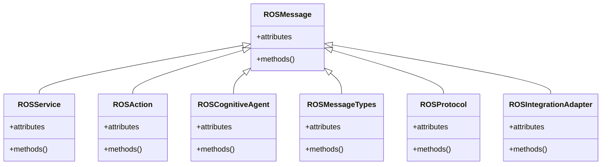

# ros_adapter - Class Diagram

```mermaid
classDiagram

    class ROSMessage {
        +methods()
        +attributes
    }

    class ROSService {
        +methods()
        +attributes
    }

    class ROSAction {
        +methods()
        +attributes
    }

    class ROSCognitiveAgent {
        +methods()
        +attributes
    }

    class ROSMessageTypes {
        +methods()
        +attributes
    }

    class ROSProtocol {
        +methods()
        +attributes
    }

    class ROSIntegrationAdapter {
        +methods()
        +attributes
    }

    ROSMessage <|-- ROSService
    ROSMessage <|-- ROSAction
    ROSMessage <|-- ROSCognitiveAgent
    ROSMessage <|-- ROSMessageTypes
    ROSMessage <|-- ROSProtocol
    ROSMessage <|-- ROSIntegrationAdapter
```
