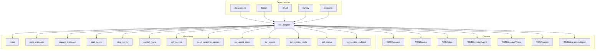

# ros_adapter - Architectural Flowchart

```mermaid
graph TD
    M[ros_adapter]

    subgraph "Classes"
        C0[ROSMessage]
        C1[ROSService]
        C2[ROSAction]
        C3[ROSCognitiveAgent]
        C4[ROSMessageTypes]
        C5[ROSProtocol]
        C6[ROSIntegrationAdapter]
    end

    M --> C0
    M --> C1
    M --> C2
    M --> C3
    M --> C4
    M --> C5
    M --> C6
    subgraph "Functions"
        F0[main]
        F4[pack_message]
        F5[unpack_message]
        F7[start_server]
        F8[stop_server]
        F25[publish_topic]
        F26[call_service]
        F27[send_cognitive_update]
        F28[get_agent_state]
        F29[list_agents]
        F30[get_system_state]
        F31[get_status]
        F32[connection_callback]
    end

    M --> F0
    M --> F4
    M --> F5
    M --> F7
    M --> F8
    M --> F25
    M --> F26
    M --> F27
    M --> F28
    M --> F29
    M --> F30
    M --> F31
    M --> F32
    subgraph "Dependencies"
        D0[dataclasses]
        D1[futures]
        D2[struct]
        D3[numpy]
        D4[argparse]
    end

    D0 --> M
    D1 --> M
    D2 --> M
    D3 --> M
    D4 --> M
```
