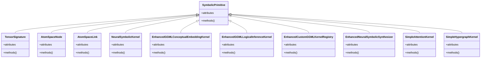

# standalone_neural_symbolic - Class Diagram

```mermaid
classDiagram

    class SymbolicPrimitive {
        +methods()
        +attributes
    }

    class TensorSignature {
        +methods()
        +attributes
    }

    class AtomSpaceNode {
        +methods()
        +attributes
    }

    class AtomSpaceLink {
        +methods()
        +attributes
    }

    class NeuralSymbolicKernel {
        +methods()
        +attributes
    }

    class EnhancedGGMLConceptualEmbeddingKernel {
        +methods()
        +attributes
    }

    class EnhancedGGMLLogicalInferenceKernel {
        +methods()
        +attributes
    }

    class EnhancedCustomGGMLKernelRegistry {
        +methods()
        +attributes
    }

    class EnhancedNeuralSymbolicSynthesizer {
        +methods()
        +attributes
    }

    class SimpleAttentionKernel {
        +methods()
        +attributes
    }

    class SimpleHypergraphKernel {
        +methods()
        +attributes
    }

    SymbolicPrimitive <|-- TensorSignature
    SymbolicPrimitive <|-- AtomSpaceNode
    SymbolicPrimitive <|-- AtomSpaceLink
    SymbolicPrimitive <|-- NeuralSymbolicKernel
    SymbolicPrimitive <|-- EnhancedGGMLConceptualEmbeddingKernel
    SymbolicPrimitive <|-- EnhancedGGMLLogicalInferenceKernel
    SymbolicPrimitive <|-- EnhancedCustomGGMLKernelRegistry
    SymbolicPrimitive <|-- EnhancedNeuralSymbolicSynthesizer
    SymbolicPrimitive <|-- SimpleAttentionKernel
    SymbolicPrimitive <|-- SimpleHypergraphKernel
```
