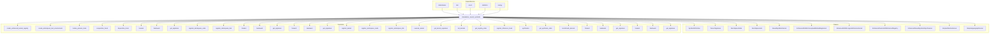

# standalone_neural_symbolic - Architectural Flowchart

```mermaid
graph TD
    M[standalone_neural_symbolic]

    subgraph "Classes"
        C0[SymbolicPrimitive]
        C1[TensorSignature]
        C2[AtomSpaceNode]
        C3[AtomSpaceLink]
        C4[NeuralSymbolicKernel]
        C5[EnhancedGGMLConceptualEmbeddingKernel]
        C6[EnhancedGGMLLogicalInferenceKernel]
        C7[EnhancedCustomGGMLKernelRegistry]
        C8[EnhancedNeuralSymbolicSynthesizer]
        C9[SimpleAttentionKernel]
        C10[SimpleHypergraphKernel]
    end

    M --> C0
    M --> C1
    M --> C2
    M --> C3
    M --> C4
    M --> C5
    M --> C6
    M --> C7
    M --> C8
    M --> C9
    M --> C10
    subgraph "Functions"
        F0[create_enhanced_kernel_registry]
        F1[create_atomspace_test_environment]
        F2[modus_ponens_hook]
        F3[conjunction_hook]
        F4[disjunction_hook]
        F5[forward]
        F6[backward]
        F7[get_signature]
        F10[register_atomspace_node]
        F11[register_atomspace_link]
        F12[forward]
        F16[backward]
        F17[get_signature]
        F20[forward]
        F28[backward]
        F29[get_signature]
        F31[register_kernel]
        F32[register_atomspace_node]
        F33[register_atomspace_link]
        F34[execute_kernel]
        F35[get_kernel_signature]
        F36[list_kernels]
        F37[get_registry_stats]
        F40[register_inference_hook]
        F41[synthesize]
        F47[get_synthesis_stats]
        F48[benchmark_kernels]
        F50[forward]
        F51[backward]
        F52[get_signature]
        F54[forward]
        F55[backward]
        F56[get_signature]
    end

    M --> F0
    M --> F1
    M --> F2
    M --> F3
    M --> F4
    M --> F5
    M --> F6
    M --> F7
    M --> F10
    M --> F11
    M --> F12
    M --> F16
    M --> F17
    M --> F20
    M --> F28
    M --> F29
    M --> F31
    M --> F32
    M --> F33
    M --> F34
    M --> F35
    M --> F36
    M --> F37
    M --> F40
    M --> F41
    M --> F47
    M --> F48
    M --> F50
    M --> F51
    M --> F52
    M --> F54
    M --> F55
    M --> F56
    subgraph "Dependencies"
        D0[dataclasses]
        D1[abc]
        D2[enum]
        D3[statistics]
        D4[numpy]
    end

    D0 --> M
    D1 --> M
    D2 --> M
    D3 --> M
    D4 --> M
```
