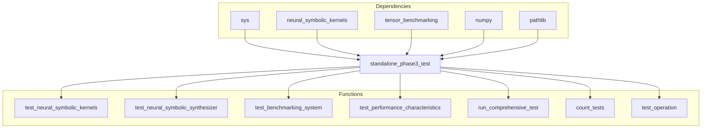

# standalone_phase3_test - Architectural Flowchart

```mermaid
graph TD
    M[standalone_phase3_test]

    subgraph "Functions"
        F0[test_neural_symbolic_kernels]
        F1[test_neural_symbolic_synthesizer]
        F2[test_benchmarking_system]
        F3[test_performance_characteristics]
        F4[run_comprehensive_test]
        F5[count_tests]
        F6[test_operation]
    end

    M --> F0
    M --> F1
    M --> F2
    M --> F3
    M --> F4
    M --> F5
    M --> F6
    subgraph "Dependencies"
        D0[sys]
        D1[neural_symbolic_kernels]
        D2[tensor_benchmarking]
        D3[numpy]
        D4[pathlib]
    end

    D0 --> M
    D1 --> M
    D2 --> M
    D3 --> M
    D4 --> M
```
