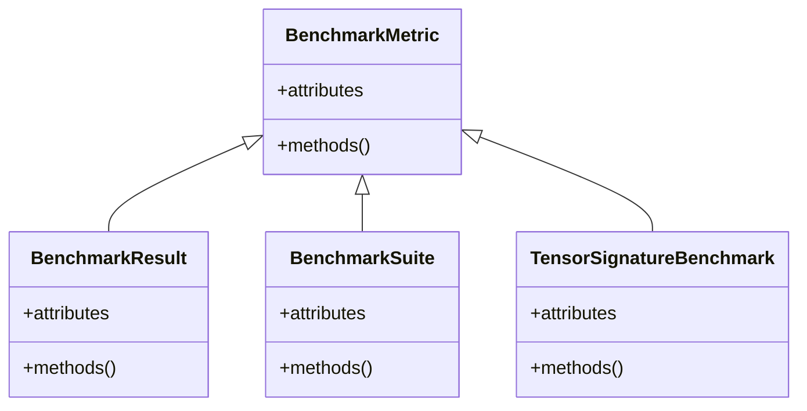

# tensor_benchmarking - Class Diagram

```mermaid
classDiagram

    class BenchmarkMetric {
        +methods()
        +attributes
    }

    class BenchmarkResult {
        +methods()
        +attributes
    }

    class BenchmarkSuite {
        +methods()
        +attributes
    }

    class TensorSignatureBenchmark {
        +methods()
        +attributes
    }

    BenchmarkMetric <|-- BenchmarkResult
    BenchmarkMetric <|-- BenchmarkSuite
    BenchmarkMetric <|-- TensorSignatureBenchmark
```
