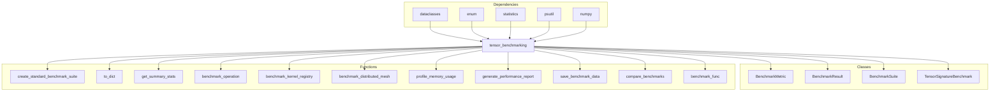

# tensor_benchmarking - Architectural Flowchart

```mermaid
graph TD
    M[tensor_benchmarking]

    subgraph "Classes"
        C0[BenchmarkMetric]
        C1[BenchmarkResult]
        C2[BenchmarkSuite]
        C3[TensorSignatureBenchmark]
    end

    M --> C0
    M --> C1
    M --> C2
    M --> C3
    subgraph "Functions"
        F0[create_standard_benchmark_suite]
        F1[to_dict]
        F2[get_summary_stats]
        F5[benchmark_operation]
        F7[benchmark_kernel_registry]
        F9[benchmark_distributed_mesh]
        F10[profile_memory_usage]
        F11[generate_performance_report]
        F12[save_benchmark_data]
        F13[compare_benchmarks]
        F14[benchmark_func]
    end

    M --> F0
    M --> F1
    M --> F2
    M --> F5
    M --> F7
    M --> F9
    M --> F10
    M --> F11
    M --> F12
    M --> F13
    M --> F14
    subgraph "Dependencies"
        D0[dataclasses]
        D1[enum]
        D2[statistics]
        D3[psutil]
        D4[numpy]
    end

    D0 --> M
    D1 --> M
    D2 --> M
    D3 --> M
    D4 --> M
```
