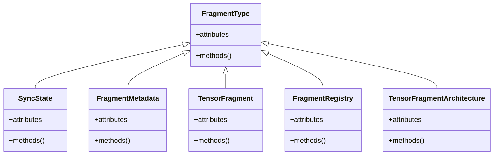

# tensor_fragments - Class Diagram

```mermaid
classDiagram

    class FragmentType {
        +methods()
        +attributes
    }

    class SyncState {
        +methods()
        +attributes
    }

    class FragmentMetadata {
        +methods()
        +attributes
    }

    class TensorFragment {
        +methods()
        +attributes
    }

    class FragmentRegistry {
        +methods()
        +attributes
    }

    class TensorFragmentArchitecture {
        +methods()
        +attributes
    }

    FragmentType <|-- SyncState
    FragmentType <|-- FragmentMetadata
    FragmentType <|-- TensorFragment
    FragmentType <|-- FragmentRegistry
    FragmentType <|-- TensorFragmentArchitecture
```
