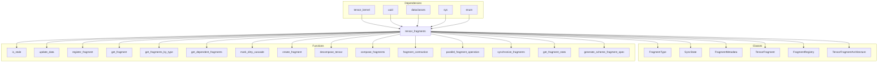

# tensor_fragments - Architectural Flowchart

```mermaid
graph TD
    M[tensor_fragments]

    subgraph "Classes"
        C0[FragmentType]
        C1[SyncState]
        C2[FragmentMetadata]
        C3[TensorFragment]
        C4[FragmentRegistry]
        C5[TensorFragmentArchitecture]
    end

    M --> C0
    M --> C1
    M --> C2
    M --> C3
    M --> C4
    M --> C5
    subgraph "Functions"
        F2[is_stale]
        F3[update_data]
        F5[register_fragment]
        F6[get_fragment]
        F7[get_fragments_by_type]
        F8[get_dependent_fragments]
        F9[mark_dirty_cascade]
        F11[create_fragment]
        F12[decompose_tensor]
        F13[compose_fragments]
        F14[fragment_contraction]
        F15[parallel_fragment_operation]
        F16[synchronize_fragments]
        F21[get_fragment_stats]
        F23[generate_scheme_fragment_spec]
    end

    M --> F2
    M --> F3
    M --> F5
    M --> F6
    M --> F7
    M --> F8
    M --> F9
    M --> F11
    M --> F12
    M --> F13
    M --> F14
    M --> F15
    M --> F16
    M --> F21
    M --> F23
    subgraph "Dependencies"
        D0[tensor_kernel]
        D1[uuid]
        D2[dataclasses]
        D3[sys]
        D4[enum]
    end

    D0 --> M
    D1 --> M
    D2 --> M
    D3 --> M
    D4 --> M
```
