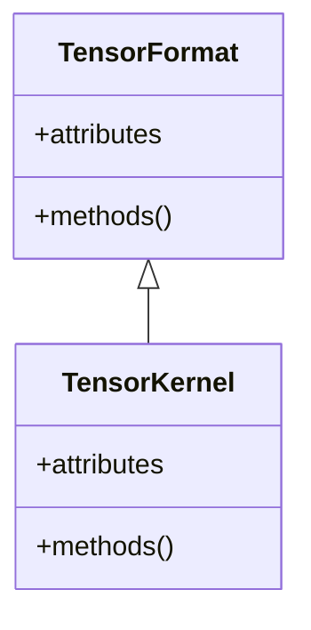

# tensor_kernel - Class Diagram

```mermaid
classDiagram

    class TensorFormat {
        +methods()
        +attributes
    }

    class TensorKernel {
        +methods()
        +attributes
    }

    TensorFormat <|-- TensorKernel
```
