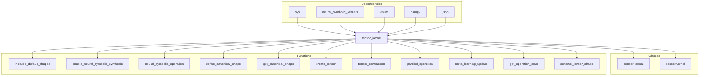

# tensor_kernel - Architectural Flowchart

```mermaid
graph TD
    M[tensor_kernel]

    subgraph "Classes"
        C0[TensorFormat]
        C1[TensorKernel]
    end

    M --> C0
    M --> C1
    subgraph "Functions"
        F0[initialize_default_shapes]
        F2[enable_neural_symbolic_synthesis]
        F3[neural_symbolic_operation]
        F4[define_canonical_shape]
        F5[get_canonical_shape]
        F6[create_tensor]
        F11[tensor_contraction]
        F12[parallel_operation]
        F18[meta_learning_update]
        F20[get_operation_stats]
        F21[scheme_tensor_shape]
    end

    M --> F0
    M --> F2
    M --> F3
    M --> F4
    M --> F5
    M --> F6
    M --> F11
    M --> F12
    M --> F18
    M --> F20
    M --> F21
    subgraph "Dependencies"
        D0[sys]
        D1[neural_symbolic_kernels]
        D2[enum]
        D3[numpy]
        D4[json]
    end

    D0 --> M
    D1 --> M
    D2 --> M
    D3 --> M
    D4 --> M
```
