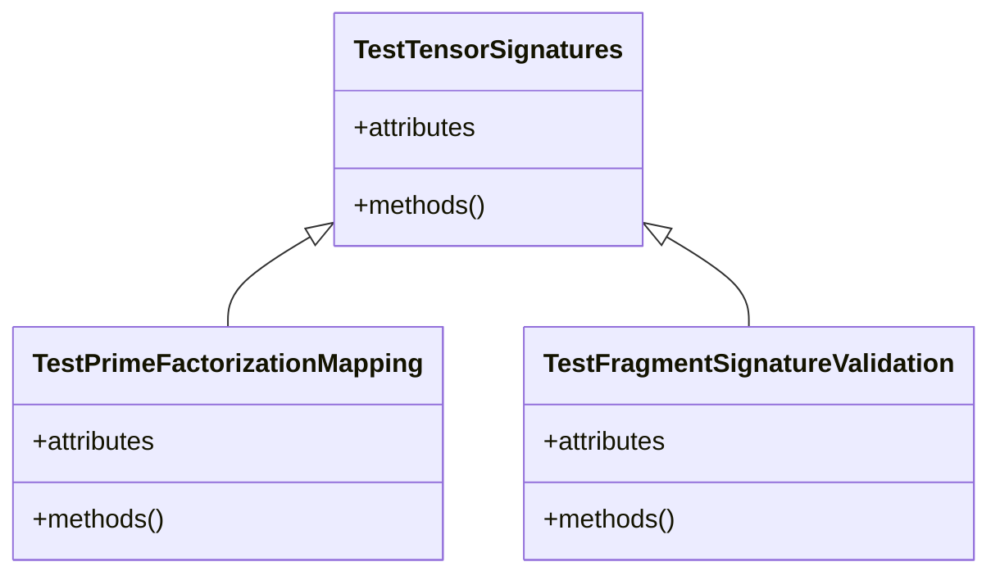

# tensor_signature_tests - Class Diagram

```mermaid
classDiagram

    class TestTensorSignatures {
        +methods()
        +attributes
    }

    class TestPrimeFactorizationMapping {
        +methods()
        +attributes
    }

    class TestFragmentSignatureValidation {
        +methods()
        +attributes
    }

    TestTensorSignatures <|-- TestPrimeFactorizationMapping
    TestTensorSignatures <|-- TestFragmentSignatureValidation
```
