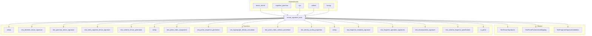

# tensor_signature_tests - Architectural Flowchart

```mermaid
graph TD
    M[tensor_signature_tests]

    subgraph "Classes"
        C0[TestTensorSignatures]
        C1[TestPrimeFactorizationMapping]
        C2[TestFragmentSignatureValidation]
    end

    M --> C0
    M --> C1
    M --> C2
    subgraph "Functions"
        F0[setUp]
        F1[test_attention_tensor_signature]
        F2[test_grammar_tensor_signature]
        F3[test_meta_cognitive_tensor_signature]
        F4[test_scheme_tensor_generation]
        F5[setUp]
        F6[test_prime_index_assignment]
        F7[test_prime_sequence_generation]
        F8[test_hypergraph_density_calculation]
        F9[test_prime_index_collision_prevention]
        F10[test_density_scaling_properties]
        F11[setUp]
        F12[test_fragment_metadata_signature]
        F13[test_fragment_operation_signatures]
        F14[test_decomposition_signature]
        F15[test_scheme_fragment_specification]
        F16[is_prime]
    end

    M --> F0
    M --> F1
    M --> F2
    M --> F3
    M --> F4
    M --> F5
    M --> F6
    M --> F7
    M --> F8
    M --> F9
    M --> F10
    M --> F11
    M --> F12
    M --> F13
    M --> F14
    M --> F15
    M --> F16
    subgraph "Dependencies"
        D0[tensor_kernel]
        D1[cognitive_grammar]
        D2[sys]
        D3[unittest]
        D4[numpy]
    end

    D0 --> M
    D1 --> M
    D2 --> M
    D3 --> M
    D4 --> M
```
