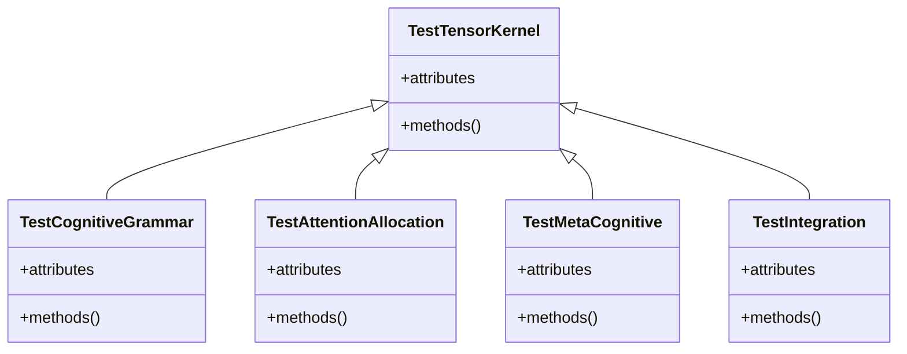

# test_cognitive_architecture - Class Diagram

```mermaid
classDiagram

    class TestTensorKernel {
        +methods()
        +attributes
    }

    class TestCognitiveGrammar {
        +methods()
        +attributes
    }

    class TestAttentionAllocation {
        +methods()
        +attributes
    }

    class TestMetaCognitive {
        +methods()
        +attributes
    }

    class TestIntegration {
        +methods()
        +attributes
    }

    TestTensorKernel <|-- TestCognitiveGrammar
    TestTensorKernel <|-- TestAttentionAllocation
    TestTensorKernel <|-- TestMetaCognitive
    TestTensorKernel <|-- TestIntegration
```
