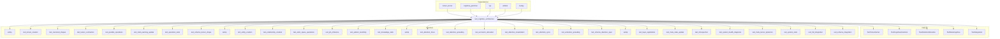

# test_cognitive_architecture - Architectural Flowchart

```mermaid
graph TD
    M[test_cognitive_architecture]

    subgraph "Classes"
        C0[TestTensorKernel]
        C1[TestCognitiveGrammar]
        C2[TestAttentionAllocation]
        C3[TestMetaCognitive]
        C4[TestIntegration]
    end

    M --> C0
    M --> C1
    M --> C2
    M --> C3
    M --> C4
    subgraph "Functions"
        F0[setUp]
        F1[test_tensor_creation]
        F2[test_canonical_shapes]
        F3[test_tensor_contraction]
        F4[test_parallel_operations]
        F5[test_meta_learning_update]
        F6[test_operation_stats]
        F7[test_scheme_tensor_shape]
        F8[setUp]
        F9[test_entity_creation]
        F10[test_relationship_creation]
        F11[test_atom_space_operations]
        F12[test_pln_inference]
        F13[test_pattern_matching]
        F14[test_knowledge_stats]
        F15[setUp]
        F16[test_attention_focus]
        F17[test_attention_spreading]
        F18[test_economic_allocation]
        F19[test_attention_visualization]
        F20[test_attention_cycle]
        F21[test_activation_spreading]
        F22[test_scheme_attention_spec]
        F23[setUp]
        F24[test_layer_registration]
        F25[test_meta_state_update]
        F26[test_introspection]
        F27[test_system_health_diagnosis]
        F28[test_meta_tensor_dynamics]
        F29[test_system_stats]
        F30[test_full_integration]
        F31[test_scheme_integration]
    end

    M --> F0
    M --> F1
    M --> F2
    M --> F3
    M --> F4
    M --> F5
    M --> F6
    M --> F7
    M --> F8
    M --> F9
    M --> F10
    M --> F11
    M --> F12
    M --> F13
    M --> F14
    M --> F15
    M --> F16
    M --> F17
    M --> F18
    M --> F19
    M --> F20
    M --> F21
    M --> F22
    M --> F23
    M --> F24
    M --> F25
    M --> F26
    M --> F27
    M --> F28
    M --> F29
    M --> F30
    M --> F31
    subgraph "Dependencies"
        D0[tensor_kernel]
        D1[cognitive_grammar]
        D2[sys]
        D3[unittest]
        D4[numpy]
    end

    D0 --> M
    D1 --> M
    D2 --> M
    D3 --> M
    D4 --> M
```
