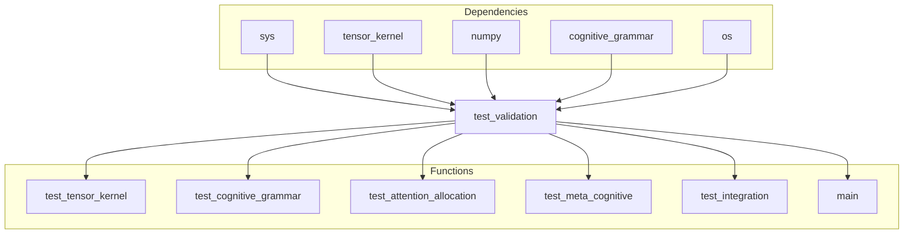

# test_validation - Architectural Flowchart

```mermaid
graph TD
    M[test_validation]

    subgraph "Functions"
        F0[test_tensor_kernel]
        F1[test_cognitive_grammar]
        F2[test_attention_allocation]
        F3[test_meta_cognitive]
        F4[test_integration]
        F5[main]
    end

    M --> F0
    M --> F1
    M --> F2
    M --> F3
    M --> F4
    M --> F5
    subgraph "Dependencies"
        D0[sys]
        D1[tensor_kernel]
        D2[numpy]
        D3[cognitive_grammar]
        D4[os]
    end

    D0 --> M
    D1 --> M
    D2 --> M
    D3 --> M
    D4 --> M
```
