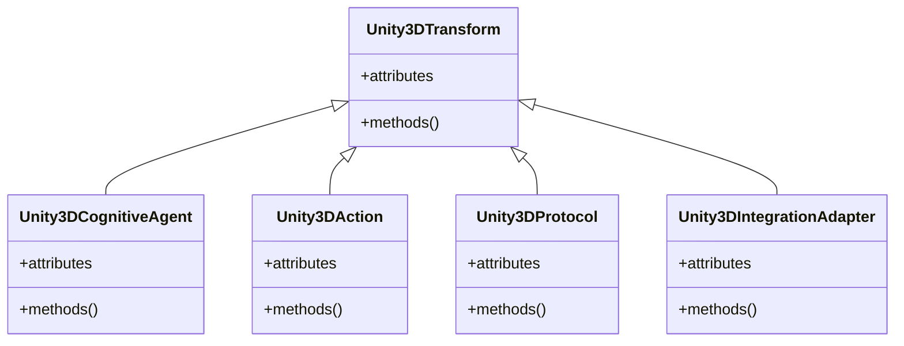

# unity3d_adapter - Class Diagram

```mermaid
classDiagram

    class Unity3DTransform {
        +methods()
        +attributes
    }

    class Unity3DCognitiveAgent {
        +methods()
        +attributes
    }

    class Unity3DAction {
        +methods()
        +attributes
    }

    class Unity3DProtocol {
        +methods()
        +attributes
    }

    class Unity3DIntegrationAdapter {
        +methods()
        +attributes
    }

    Unity3DTransform <|-- Unity3DCognitiveAgent
    Unity3DTransform <|-- Unity3DAction
    Unity3DTransform <|-- Unity3DProtocol
    Unity3DTransform <|-- Unity3DIntegrationAdapter
```
