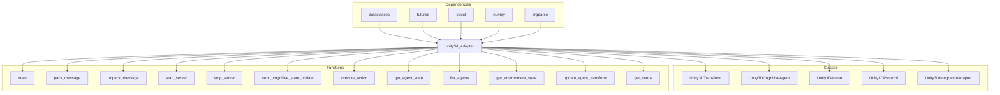

# unity3d_adapter - Architectural Flowchart

```mermaid
graph TD
    M[unity3d_adapter]

    subgraph "Classes"
        C0[Unity3DTransform]
        C1[Unity3DCognitiveAgent]
        C2[Unity3DAction]
        C3[Unity3DProtocol]
        C4[Unity3DIntegrationAdapter]
    end

    M --> C0
    M --> C1
    M --> C2
    M --> C3
    M --> C4
    subgraph "Functions"
        F0[main]
        F3[pack_message]
        F4[unpack_message]
        F6[start_server]
        F7[stop_server]
        F18[send_cognitive_state_update]
        F19[execute_action]
        F20[get_agent_state]
        F21[list_agents]
        F22[get_environment_state]
        F23[update_agent_transform]
        F24[get_status]
    end

    M --> F0
    M --> F3
    M --> F4
    M --> F6
    M --> F7
    M --> F18
    M --> F19
    M --> F20
    M --> F21
    M --> F22
    M --> F23
    M --> F24
    subgraph "Dependencies"
        D0[dataclasses]
        D1[futures]
        D2[struct]
        D3[numpy]
        D4[argparse]
    end

    D0 --> M
    D1 --> M
    D2 --> M
    D3 --> M
    D4 --> M
```
